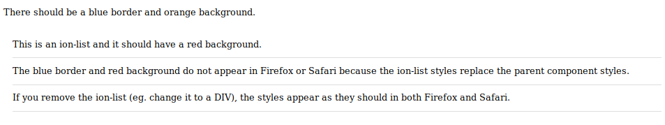

# ionic-vue-shadow-styles-bug

This repo isolates an issue with `@ionic/vue` where component styles get wiped out by nested ionic component styles in Firefox and Safari.

```
git clone https://github.com/DesignByOnyx/ionic-vue-shadow-styles-bug.git
cd ionic-vue-shadow-styles-bug
yarn
yarn serve
```

## The problem

**Chrome:**


**Firefox/Safari:**


In Firefox and Safari, the styles for a custom component will get replaced with ionic component styles. The issue arises from a combination of `@ionic/vue` and use of an ionic component inside a shadow DOM. To reproduce the issue, do the following:

- create a component which uses `shadow: true` and custom styles
- use an ionic component somewhere within the render function
  - note: the issue only happens with ionic components which use `shadow: false` (eg. ion-list)

### The problem goes away if either:

- you comment out `Vue.use(Ionic)`
- or, you don't use an ionic component in your render function

**Note:** This problem only occurs when an ionic component is used. We tested with other custom components (not ionic) and everything worked as expected.

**Note 2:** We were able to produce the same error with `@ionic/react` - simply importing `IonList` from `@ionic/react` caused the same exact result.

## About this project

- This is a vanilla vue app (typescript) created with `vue create`
  - All unnecessary files and components were removed to eliminate distractions
  - `@ionic/vue@^0.0.9` was added as a dependency and configured in `src/main.ts`
  - ui-components were added and configured per the [stencil integration docs](https://stenciljs.com/docs/vue)
- The ui-components folder was created with `npm init stencil`
  - All unnecessary files were removed to eliminate distractions
  - `@ionic/core` was added as a dependency
  - A single component was created with `shadow: true` and some custom styles
  - An ionic component **without shadow dom** was rendered (eg. ion-list)
